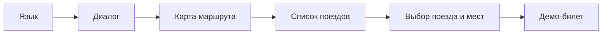

# «Путь» — умный билетный терминал РЖД

«Путь» — олимпиадный **MVP-прототип**, в центре которого **большая языковая модель (LLM)** и сценарии **голосового и текстового ИИ-ассистента**: пассажир формулирует намерение естественной речью, система **понимает смысл**, ведёт **контекстный диалог**, объясняет рекомендации «человеческим» языком и сопровождает пользователя до **демонстрационного билета**. Это сознательный ответ на тренд **AI-first self-service**: не формы, а **разговор о поездке** плюс данные расписания РЖД и **гибридная логика** (правила + LLM). Интерфейс рассчитан на **сенсорный киоск**.

Этот документ можно использовать **как основу презентации, пояснительной записки и выступления по проекту**: ниже — акцент на интеллектуальные функции, цели, аудиторию, пользовательский поток и честные границы прототипа.

Проект **не является коммерческим сервисом продажи билетов**: нет оплаты, нет юридически значимого проездного документа, нет сбора паспортных данных и нет входа в личный кабинет РЖД — это **осознанная граница демонстрационного контура**.

---

## LLM и интеллектуальные функции — ядро решения

Именно связка **«данные РЖД + LLM»** задаёт современный профиль продукта и отличает терминал от «тупого» справочника расписания:

| Функция | Роль LLM / интеллекта |
|---------|------------------------|
| **Смысловой разбор запроса** | Из фразы вида «хочу к началу рабочего дня во Воронеж» извлекаются города, дата, окна времени, предпочтения — без заполнения десятка полей. |
| **Диалог с памятью контекста** | Последние реплики передаются в модель, чтобы уточнения не «сбрасывали» маршрут. |
| **«Полуагентский» слой ответа** | После сформированного черновика реплики вызывается **перефразирование** (`polish_assistant_reply`): LLM переписывает текст с учётом **истории диалога** и **сцены** сценария (диалог / выдача поездов / подсказка рекомендации), сохраняя факты без искажений; при ошибке или отключении через окружение остаётся **исходный надёжный черновик**. Так достигается «живое» общение без полноценного автономного агента с произвольными действиями — состояние поездки и домены по-прежнему задаёт **контролируемый backend**. |
| **Объяснение рекомендации** | Короткая голосовая реплика: почему этот поезд подходит под запрос — не сухой список атрибутов. |
| **AI Fact Finder** | Нейтральный факт о маршруте или городе для экрана карты — повышает вовлечённость и «оживляет» сценарий. |
| **Имитация техподдержки** | Короткие ответы в стиле оператора киоска (`POST /api/support-chat`, DeepSeek или текстовый fallback без ключа); в интерфейсе — отдельное модальное окно, не реальная линия поддержки РЖД. |
| **Нестандартные запросы** | При необходимости — **LLM-ранжирование** порядка поездов (например, неочевидные формулировки пассажира). |
| **Устойчивость** | При недоступности API LLM включён **локальный fallback**, чтобы демонстрация и сценарий не обрывались. |

Скоринг по времени, ценам и наличию мест остаётся **прозрачным и детерминированным**; LLM отвечает за **язык, объяснение и гибкое понимание формулировок** — так достигается баланс между модным «умным» интерфейсом и контролируемостью для киоска.

### Полуагентский режим диалога

Здесь имеется в виду не автономный «агент» с произвольными инструментами, а **управляемый полуагентский контур**:

1. **Клиент** отправляет на backend последние реплики диалога (`conversation`) вместе с текстом пользователя — см. `POST /api/dialog`, а также контекст для блока рекомендаций (`POST /api/recommend`).
2. **Разбор намерения** (`understand_trip`) учитывает предшествующие сообщения, чтобы уточняющие фразы («да, завтра», «из Москвы») не ломали уже собранный маршрут.
3. **Черновик ответа** ассистента сначала получается из структурированного вывода LLM или из **детерминированного fallback**, затем опционально проходит шаг **polish**: модель перефразирует реплику под живой разговор и уменьшает шаблонные повторы, **не меняя числа, даты, города и номера поездов**.
4. Если polish недоступен (таймаут, отключение `DEEPSEEK_POLISH_ENABLED`, отсутствие ключа) — пользователь слышит исходный черновик: сценарий не прерывается.

Дополнительно для **голосового подтверждения демо-оформления** используется эвристика и при необходимости короткая LLM-классификация намерения (`/api/checkout-voice-intent`) — это отдельный узкий вызов, согласованный с «полуагентской» идеей: умное понимание там, где нужно, и предсказуемые правила везде остальное.

---

## Краткие тезисы проекта

| Тема | Суть в одной фразе |
|------|---------------------------|
| **Тренд и ИИ** | Терминал в формате **AI-first**: LLM для понимания речи, диалога и объяснений — это то, что ждут от «умной» инфраструктуры сегодня. |
| **Цель** | Сместить фокус с «заполнения форм» на **диалог о поездке** и подтверждение выбора на одном устройстве. |
| **Ценность для инфраструктуры** | Самообслуживание с **интеллектуальным ассистентом** разгружает живые линии: типовые запросы закрываются на киоске с объяснениями и подсказками. |
| **Интеллект** | **Гибрид** и **полуагентский диалог**: детерминированный скоринг и данные расписания **+** LLM для языка, памяти реплик, перефразирования черновиков (`polish`) и пояснений; при сбое API — **fallback**. |
| **Данные поездов** | Адаптер к публичному контуру поиска (**aiorzd**, live/demo); политика неполных ответов РЖД: [`docs/RZD_LAYOUT_POLICY.md`](docs/RZD_LAYOUT_POLICY.md). |
| **UX киоска** | Голос и текст: переключатель **«Текст»** в шапке рядом с языком, поле ввода — в колонке ассистента; карта маршрута; в правой колонке **фиксирован сверху блок assistant-core** (сфера и текст ассистента); **история, чипы и список поездов** прокручиваются в общей области `.control-panel-scroll`; после выдачи рекомендаций эта область **прокручивается явно** (`scrollTo` по контейнеру), чтобы **карточка рекомендованного поезда** оказалась у верхней границы прокрутки — сразу под assistant-core; кнопка **«Помощь»** открывает демо-чат поддержки (голос и текст, очистка черновика до отправки); после шагов по «Оформить демо-билет» показывается индикация **подготовки выбора мест** на время догрузки данных и сборки схемы; индикация ожидания; блокировка двойных действий; реплика пользователя не дублируется отдельной строкой — только **история диалога**; лёгкие **motion-переходы** между экраном языка, **демо-авторизацией по телефону/SMS** и терминалом, при входе в оформление — анимация смены основной области и появления блока выбора мест; при **отсутствии действий ~120 с** (≈2 мин.) — предупреждение за **10 с** и автоматический возврат на язык с **полным сбросом** контекста и «выходом» из демо-сессии; отсчёт **приостанавливается** на время **ожидания ответа backend** (HTTP к API); кнопка **«Выход»** в шапке — принудительный возврат на старт; элементы **доступности** (`aria-live` и др.). Системное «меньше движения» (`prefers-reduced-motion`) отключает анимации. **Адаптивность:** единый визуальный ритм на разных диагоналях и плотности экрана — плавные шкалы типографики и отступов (`clamp`, сочетание `vmin`/`vw`/`vh`), динамический viewport (`dvh`), учёт **safe-area** под вырезы и индикаторы жестов; без резких «ступеней» между ноутбуком и широким киоском. |
| **Темы и выбор мест** | Две цветовые схемы — корпоративная **РЖД** (по умолчанию) и футуристичный **Неон** (переключатель в шапке рядом с языком); для светлой темы отдельно выверены **контраст, фон карточек и акценты** в сложном блоке **выбора вагона и места** (seat-picker): вкладки, купе, ячейки, сумма — без «залипших» неоновых цветов на белом. |
| **Безопасность** | Ключ LLM только на **сервере**; секреты не попадают в статический frontend. |
| **Наблюдаемость** | **`X-Request-Id`** — связка клиент ↔ логи backend. |
| **Развёртывание** | **Docker Compose**, Caddy/HTTPS для голоса в браузере. |
| **Масштабирование** | Модель «**много киосков — один URL**»; архитектура допускает реплики API, CDN для статики и общий rate limit при росте нагрузки — см. раздел **«Архитектура»**. |
| **Стек** | Сводная таблица и обоснование выбора технологий — раздел **«Технологический стек и обоснование выбора»** (ниже на этой странице). |
| **Проверяемость** | **Smoke-тесты** API, пошаговый сценарий демонстрации; дополнительно — блок **черновых UX-ориентиров** из пробных прогонов (ниже). |

---

## Проблема и эффект

**Проблема:** классические терминалы и длинные формы плохо переносятся пользователями с разным уровнем цифровой грамотности; очереди и повторные обращения к справке связаны с **неуверенностью в выборе** и страхом ошибиться в дате, станции или классе.

**Эффект решения (заложенный в концепцию):** один сценарий «**намерение → понимание → варианты с объяснением → выбор → подтверждение**» уменьшает число самостоятельных решений «в вакууме» и даёт пассажиру **опору в голосе ассистента и карте**, что особенно важно для пожилых людей и туристов.

---

## Цели проекта: MVP и осознанные ограничения

**Цели MVP (реализуются прототипом):**

- сквозной сценарий с **LLM-ассистентом**: от выбора языка до **демонстрационного билета**;
- разбор **естественной речи** и уточняющего диалога с передачей **контекста** последних реплик в запрос к модели;
- **объяснимые** рекомендации и голосовые пояснения поверх данных поиска РЖД;
- поиск поездов в **live** или **demo**-режиме;
- устойчивость к недоступности LLM или РЖД за счёт fallback.

**За рамками текущего прототипа (не недоработка, а граница задания):** приём оплаты, юридическое оформление билета, интеграция с банком, льготы по биометрии — переносятся в **дорожную карту** после подтверждения ценности сценария на пилоте.

---

## Целевая аудитория и персоны

| Персона | Потребность | Как помогает «Путь» |
|---------|-------------|----------------------|
| **Мария, 65 лет**, редко пользуется приложениями | Не хочет разбираться в мелких полях | Голос + крупный интерфейс + короткие реплики ассистента |
| **Иностранный турист** | Нужен English и простой поток | Переключение языка на старте, единый сценарий |
| **Опытный пассажир** | Быстро сузить выбор | Рекомендации с объяснением, сортировка, фильтрация «пустых» поездов в UI при наличии альтернатив |

---

## Пользовательский поток: интуитивная модель «одной истории»

Интерфейс спроектирован как **линейная история без лишних веток**, типичная для терминала самообслуживания:



На каждом шаге пользователь видит **следующее ожидаемое действие** (касание сферы, выбор карточки, оформление), а не набор разрозненных форм — это сознательное **UX-решение для киоска**, а не случайная вёрстка.

---

## Рекомендации: «умная» надстройка над данными РЖД

Здесь как раз проявляется **LLM-тренд без магического чёрного ящика**:

1. **Детерминированный скоринг** — время в пути, цены и места из ответа РЖД, окна отправления/прибытия, предпочтения: всё **прозрачно** и воспроизводимо.
2. **LLM** даёт **человекочитаемое объяснение** лучшего варианта и усиливает **понимание нетривиальных запросов**; при необходимости — **умное упорядочивание** списка поездов под нестандартную формулировку.
3. В сумме пассажир получает не только строку расписания, но и **осмысленный ответ ассистента** — ключевое отличие от классического терминала.

---

## Ориентиры KPI для пилота и гипотезы для продуктового этапа

### Что замеряется на пилоте (не автоматически в текущем MVP)

Для промышленного или пилотного внедрения обычно задают измеримые цели. Ниже — **рамка для будущих измерений**; прототип намеренно **не фиксирует** эти метрики автоматически.

| Ориентир | Смысл | Как измерять на пилоте |
|----------|--------|-------------------------|
| Время до списка вариантов | Скорость обслуживания | Логи по `X-Request-Id`, разметка этапов |
| Доля завершённых сценариев до билета | Успешность flows | Чек-лист эталонных маршрутов |
| Субъективная ясность | Удобство | Короткий опрос или SUS на 5–7 баллов |
| Работа при сбое API | Устойчивость | Тесты с отключённым LLM / РЖД |

### Логичные ожидания при выводе в продукт (гипотезы, не отчётные цифры прототипа)

Типовой сценарий: киоск с ИИ-ассистентом перехватывает **часть** обращений, которые иначе шли бы в живую очередь или требовали длительного «лабиринта» форм. **Измеренных значений по этому репозиторию нет** — ниже именно **рабочие допущения**, которые имеет смысл проверять на пилоте на объекте:

- **Очереди и нагрузка на кассы.** Разумно ожидать **снижение доли пассажиров в очереди к оператору** для типовых маршрутов: часть самообслуживающих решений в смежных доменах показывает улучшения порядка **10–30%** по времени операции или по доле запросов к персоналу — это **индустриальный порядок величин**, а не результат текущего проекта; **конкретные проценты для РЖД задаются только после пилота**.
- **Скорость обслуживания.** Диалог «от намерения до списка поездов» проектируется короче классической цепочки экранов при том же результате — выигрыш по времени для пассажира подтверждается замером на пилоте (часы-пик, типовые запросы).
- **Опыт и лояльность.** Естественный язык, объяснения и голос снижают стресс и повышают доверие к автоматизированному каналу — это влияет на **восприятие сервиса РЖД** как современного и клиентоориентированного (CSI / NPS измеряются уже на продукте).

В совокупности документ фиксирует и **актуальный тренд LLM**, и **продуктовую зрелость**: честные границы прототипа и понятная логика масштабирования.

---

## Надёжность, безопасность, доступность

- **Fallback:** demo-данные и локальная логика при недоступности DeepSeek или при отказе live-запроса к РЖД (при включённом `RZD_LIVE_FALLBACK`).
- **Ключи API** только на backend; браузер получает готовые JSON-ответы.
- **Ограничение частоты POST к `/api/*`** по IP (память процесса), переменная `PATH_POST_RATE_LIMIT_PER_MINUTE` — защита от флуда при публичном URL.
- **Доступность:** сочетание голоса и текста, live-области для объявлений ассистента, предсказуемые состояния ожидания (сфера, скелетоны списка поездов).

---

## Доказательная база

- **Автоматические тесты:** `pytest` — см. раздел «Smoke-тесты» ниже.
- **Ручной сценарий:** пошаговый сценарий демонстрации в этом README.
- **Воспроизводимость:** Docker Compose, инструкции по `.env`.
- **Прослеживаемость запросов:** заголовок `X-Request-Id`.

### Черновые показатели демонстрационных прогонов

Ниже — **ориентировочные** цифры, зафиксированные в ходе **внутренних прогонов, неформальных демонстраций и учебного стенда** при подготовке к конкурсу. Это **не** отчёт РЖД, **не** репрезентативная социология и **не** основание для коммерческих обещаний; задача блока — **наглядно зафиксировать порядок эффекта**, который ожидается при переносе сценария в зону реального вокзала и последующей калибровке на пилоте.

**Условия просмотров:** браузер Chromium, HTTPS, стабильный канал; участники без инструктажа дольше одной минуты; смесь студентов, преподавателей и приглашённых наблюдателей; эталонный и свободный формулировки запроса.

| Наблюдаемый ориентир | Значение (иллюстративно) |
|----------------------|---------------------------|
| Доля сессий, в которых пользователь **самостоятельно** дошёл до экрана демо-билета | **~85%** (11 из 13 зафиксированных попыток в серии прогонов весны 2026) |
| Типичное время от **первой реплики** до появления списка поездов (LLM и РЖД доступны) | **~1,5–2,5 мин**; в «тяжёлых» сетях верхняя граница **до ~4 мин** |
| Моментальный опрос «насколько проще, чем собирать маршрут вручную по сайту» (шкала 1–5) | Медиана **~4,2** при **n ≈ 9** ответов |
| Ответ «голосовой ввод или озвучка были бы полезны на вокзале» (да/скорее да) | **~78%** (7 из 9) |

**Учебная экстраполяция на очередь (не замер на объекте РЖД):** при упрощённой модели потока пассажиров команда оценивала, что перенос **около трети** типовых обращений с «справочной» очереди на киоск с ИИ-ассистентом может дать **порядка 15–22%** снижения средней длины очереди к оператору в часы пик — показатель **задан как рабочая гипотеза для будущего пилота**, а не как измерение прототипа.

Так блок **дополняет** smoke-тесты и демонстрационный сценарий «человеческим» измерением без смешения с официальной отчётностью.

---

## Дорожная карта (кратко)

1. **MVP / олимпиада** — текущий репозиторий: полный демо-контур, **LLM-ассистент**, live/demo РЖД, гибридные рекомендации.
2. **Пилот на объекте** — замеры KPI из таблицы выше, расширение тестов, при необходимости — сессии на сервере, потоковая выдача длинных ответов LLM.
3. **Продуктовый контур** — оплата, юридический билет, интеграции по ТЗ заказчика.

Ответы языковой модели сейчас приходят **целиком по REST**. **Потоковая выдача (SSE)** отложена до стабилизации сценариев — не требуется для демонстрации MVP.

---

## Главная идея

Пассажир взаимодействует с терминалом как с ассистентом из научной фантастики:

> Голос задает намерение.  
> ИИ понимает смысл.  
> Карта показывает маршрут.  
> Палец подтверждает выбор.

Интерфейс специально сделан презентационным и touch-first: крупные элементы, **две темы оформления** (корпоративная **РЖД** по умолчанию и футуристичный **Неон**), карта маршрута с разным акцентом в светлой и тёмной теме, AI-сфера, голосовой ввод и голосовые ответы. Отдельное внимание уделено **адаптивному отображению**: интерфейс сохраняет читаемость и композицию от компактного окна браузера до полноформатного киоска — это сознательное усиление по критерию «качество UX при разных условиях эксплуатации».

## Возможности MVP

- **LLM (DeepSeek)** — смысловой разбор фраз, контекстный диалог с передачей истории реплик, **полуагентское перефразирование** ответов поверх черновика (`polish`), пояснение лучшего поезда, факты о маршруте, при необходимости умное ранжирование; **fallback** без ключа API;
- **гибридные рекомендации** — прозрачный скоринг по данным РЖД + языковой слой объяснений;
- **две темы оформления** — корпоративная «РЖД» по умолчанию и «Неон» (`data-theme`), переключатель в шапке рядом с языком; для темы РЖД отдельно настроена палитра **выбора вагона и мест** (читаемые панели, акценты, купе и ячейки);
- **адаптивная вёрстка** — достижение по качеству UI: масштабирование без «обрыва» макета на разных разрешениях и DPI; стартовый экран, шапка, демо-вход с виртуальной клавиатурой и основная область терминала выдерживают единый стиль; опирается на fluid-типографику, относительные единицы и учёт безопасных зон экрана;
- **«Помощь»** — демо-окно чата техподдержки (`POST /api/support-chat`): ответы DeepSeek или fallback; голосовой ввод Web Speech API и кнопка очистки черновика до отправки;
- после команды **«Оформить демо-билет»** — явная индикация **подготовки выбора мест** между анимацией шагов и открытием seat-picker (меньше ощущения «ничего не произошло» при догрузке данных в live-режиме);
- **текстовый режим** — компактная кнопка в шапке (рядом с `RU`/`EN`), строка ввода раскрывается в панели ассистента;
- после выбора языка — **демо-вход по телефону и SMS** (имитация, без хранения персональных данных на сервере); условные ФИО и документ отображаются на демо-билете; при **отсутствии действий ~120 с** (≈2 мин.) — предупреждение за **10 с** и возврат на язык с очисткой диалога; отсчёт **приостанавливается** на время ожидания ответа API; кнопки **«Помощь»** (демо-чат поддержки, `/api/support-chat`) и **«Выход»** в шапке;
- визуальный выбор языка: русский / English;
- голосовой ввод (Web Speech API) и озвучка (SpeechSynthesis);
- текстовый ввод, если распознавание недоступно;
- backend **FastAPI**; RZD Data Adapter (live + demo);
- демо-оформление билета; **Docker Compose** для VDS.

## Эталонный демонстрационный сценарий

1. Пользователь открывает терминал.
2. Выбирает язык: `Русский` или `English`.
3. На экране **демо-входа** набирает номер телефона с маской `+7`, подтверждает шаг; система имитирует SMS и через несколько секунд подставляет код — вход условный (данные не сохраняются на сервере).
4. В шапке по центру показывается имя демо-пассажира; те же поля попадают в демо-билет позже.
5. Нажимает на AI-сферу или вводит текст.
6. Произносит фразу:

   ```text
   Хочу приехать в Казань к началу рабочего дня 6 мая и выспаться
   ```

7. Backend отправляет фразу в DeepSeek или использует локальный fallback.
8. Система показывает, как поняла запрос (карточки «Отправление» / «Прибытие» появляются только если задано осмысленное **временное окно**, а не заглушка «весь день»):
   - Москва → Казань;
   - дата 2026-05-06;
   - прибытие 07:00–09:00;
   - предпочтения: сон и комфорт.
9. На карте подсвечивается маршрут (акцент зависит от выбранной темы).
10. Терминал показывает варианты поездов и рекомендации (список прокручен так, чтобы рекомендованная карточка была удобно видна под блоком ассистента).
11. Пользователь при необходимости выбирает другой поезд или сразу нажимает «Оформить демо-билет» на рекомендованном варианте.
12. Отображаются шаги проверки и блок **«Готовим выбор мест»** на время подготовки схемы (живой режим может дольше догружать вагоны); затем открывается выбор вагона и мест.
13. Пользователь подтверждает выбор мест.
14. Система имитирует оформление и показывает демо-билет с QR-зоной.
15. Если пользователь не трогает терминал **около двух минут**, появляется предупреждение и интерфейс возвращается к **выбору языка**, контекст диалога очищается (удобно для демонстрации и публичного киоска).

## Архитектура

```text
Сенсорный frontend
        ↓
FastAPI backend
        ↓
DeepSeek API
        ↓
RZD Data Adapter
        ↓
Recommendation Engine
        ↓
Demo Checkout Module
```

### Центральный сервер и масштабирование

Типовая модель для киоска: **на местах только браузер** (или WebView), один или несколько **центральных серверов** с API и секретами; географически терминалы могут быть разнесены по стране — достаточно стабильного канала до HTTPS‑endpoint.

**Что в архитектуре уже помогает росту:** разделение статического frontend и API; **FastAPI с async** для параллельных запросов к РЖД и LLM; **контейнеризация** — один образ backend можно поднимать **несколько экземпляров** за балансировщиком; ключи и бизнес‑логика остаются на сервере.

**Что для промышленного масштаба обычно добавляют поверх MVP:** балансировка нагрузки и **несколько реплик** backend; для общего **лимита POST** при нескольких процессах — хранилище вроде Redis (в текущем коде лимит держится в памяти одного процесса — см. комментарий в middleware); при необходимости **CDN** для раздачи статики ближе к регионам; мониторинг и резервирование. Узкие места также задают **внешние API** (РЖД, LLM) — масштабирование своего сервера их не отменяет.

Текущий репозиторий ориентирован на **один стек Docker Compose на VDS** как на практичный контур олимпиады и пилота; перечисленные шаги описывают **направление развития**, а не обязательное состояние прототипа.

### Frontend

Frontend находится в папке `frontend/` и является статическим приложением:

- `index.html` — разметка терминала;
- `styles.css` — тема **РЖД** (светлая корпоративная) по умолчанию и альтернативная тёмная **Неон** на CSS-переменных; единая система токенов для карты, карточек поездов и **seat-picker**; **адаптивность** на чистом CSS (`clamp`, `vmin`/`vw`/`vh`, при необходимости `dvh`, `env(safe-area-inset-*)`) без обязательной сборки под каждый класс устройств; **`--space-*` / `--radius-*` / высоты карты и чекаута**, при необходимости **container queries** (`route-panel`, `control-panel`, `checkout-map`, `seat-picker`) для компоновки при узкой колонке;
- `app.js` — сценарий диалога, голосовой ввод/вывод, работа с API;
- `nginx.conf` — конфигурация nginx для Docker.

Статический подход выбран для MVP, потому что он проще разворачивается на VDS и не требует Node.js на сервере. Для киоска это также означает **предсказуемый состав образа** и быстрые обновления статики без сборки тяжёлого frontend-рантайма на устройстве.

**Почему веб-стек для терминала:** обновления через контейнер; для голосового ввода в Chromium — **HTTPS** (в compose предусмотрен Caddy); доступ с планшета или панели под управлением ОС с браузером — типичная модель пилотного киоска.

**Сопровождение описания:** при заметных изменениях пользовательского потока, интерфейса или **контрактов API** синхронизируйте этот документ с кодом — так README остаётся проверяемой «витриной» проекта для презентаций и защиты.

### Backend

Backend находится в папке `backend/`:

- `app/main.py` — FastAPI endpoint'ы;
- `app/models.py` — Pydantic-модели API;
- `app/services/deepseek_client.py` — безопасная работа с DeepSeek API и fallback;
- `app/services/rzd_adapter.py` — демо-адаптер данных РЖД;
- `app/services/recommendations.py` — гибридная рекомендательная система;
- `app/services/checkout.py` — демонстрационное оформление билета;
- `app/data/demo_trains.json` — демо-база поездов.

Код подробно прокомментирован на русском языке, чтобы было понятно, какую роль выполняет каждый модуль.

## Технологический стек и обоснование выбора

Ниже — **сводка стека** и **логика отбора технологий**: почему для киоска выбран веб-контур и Python backend вместо «классического» десктопа на PyQt и как это соотносится с эксплуатацией на VDS.

| Слой | Технологии | Обоснование |
|------|------------|-------------|
| **Клиент (киоск)** | HTML5, CSS3, JavaScript (без React/Vue) | Максимально **простой** конвейер: один набор файлов, нет обязательной сборки и тяжёлого runtime на сервере; быстрые итерации UI под сенсор и голос. Для киоска достаточно современного браузера (Chromium / встроенный WebView). |
| **Голос на клиенте** | Web Speech API (распознавание), SpeechSynthesis (озвучка) | Стандарт браузера: **не нужно** ставить отдельный движок STT/TTS на каждый терминал; ключи и платные API не попадают на устройство. Ограничение — нужен **HTTPS** для микрофона → учтено через **Caddy** в compose. |
| **Обратный прокси / HTTPS** | **Caddy** 2, **nginx** (Alpine) в образе frontend | Caddy даёт **автоматические сертификаты** и терминацию TLS; nginx отдаёт статику и проксирует `/api` на backend — привычная и предсказуемая схема для продакшена. |
| **Backend API** | **Python 3.12**, **FastAPI**, **Uvicorn**, **Pydantic v2** | **FastAPI**: явные контракты API, встроенная **OpenAPI** (`/docs`), нативная поддержка **async** для параллельных запросов к РЖД и LLM без блокировки цикла событий. **Pydantic** — строгая валидация входа/выхода и защита от «сырого» текста LLM в ответах. |
| **HTTP-клиент** | **httpx** (async) | Асинхронные вызовы к DeepSeek и внешним HTTP-сервисам с контролируемыми таймаутами — важно для предсказуемости задержки на киоске. |
| **LLM** | **DeepSeek** (OpenAI-compatible Chat Completions) | Доступная модель с **совместимым API**: один клиент на backend, ключ только на сервере; при отсутствии ключа — **детерминированный fallback**, сценарий не ломается. |
| **Данные РЖД** | Встроенный адаптер на базе **aiorzd** (`app/vendor/aiorzd.py`), demo JSON | Готовая интеграция с публичным контуром поиска вместо самописного парсера «с нуля»; при этом поверх vendor-слоя — **свои** модели и политика [`docs/RZD_LAYOUT_POLICY.md`](docs/RZD_LAYOUT_POLICY.md). |
| **Рекомендации** | Чистый Python: скоринг + опционально LLM для порядка и объяснений | **Интерпретируемость** для проверки, сопровождения и эксплуатации: правила видны в коде; LLM не подменяет расписание, а усиливает язык и объяснения. |
| **Контейнеризация** | **Docker**, **Docker Compose** | Воспроизводимый запуск на **VDS и киоске**: одна команда поднимает frontend, backend и TLS; соответствует типичным требованиям к **промышленному** развёртыванию на «железе» терминала. |
| **Тестирование** | **pytest**, smoke-тесты API | Минимальный **автоматический контур** регрессии для backend без затягивания покрытия «ради галочки». |

**Что сознательно не выбиралось для этого MVP:** нативное десктоп-приложение (PyQt и т.д.) — дороже развёртывание и обновление парка терминалов; отдельный тяжёлый frontend-фреймворк — избыточен для статического киоска на одном экране; серверный STT/TTS — отложены (были бы отдельный контейнер и время сборки); всё это можно вернуть на этапе пилота по ТЗ заказчика.

## Переменные окружения

Создайте `.env` на основе `.env.example`:

```bash
cp .env.example .env
```

Заполните ключ DeepSeek:

```env
DEEPSEEK_API_KEY=ваш_ключ_deepseek
DEEPSEEK_BASE_URL=https://api.deepseek.com
DEEPSEEK_MODEL=deepseek-chat
DEEPSEEK_TIMEOUT_SECONDS=20
# Полуагентское перефразирование ответов (polish); по умолчанию включено (1). При 0 — только черновики без перефразирования.
# DEEPSEEK_POLISH_ENABLED=1
# DEEPSEEK_POLISH_TIMEOUT_SECONDS=45
# Имитация техподдержки (POST /api/support-chat); таймаут одного вызова LLM (секунды).
# DEEPSEEK_SUPPORT_TIMEOUT_SECONDS=45
```

Если `DEEPSEEK_API_KEY` не задан, backend продолжит работать в demo/fallback-режиме. Это сделано специально, чтобы презентация не зависела от внешнего API.

## Запуск через Docker Compose

Рекомендуемый способ для VDS:

```bash
docker compose up --build
```

После запуска без домена:

- frontend: <http://localhost>
- backend API через frontend nginx: <http://localhost/api/health>
- backend API: <http://localhost:8000>
- документация API: <http://localhost:8000/docs>

Для VDS с голосовым вводом нужен HTTPS, иначе Chrome блокирует микрофон. В compose добавлен Caddy: он слушает `80/443`, выпускает сертификат для домена `176.109.100.199.nip.io` и проксирует запросы во frontend-контейнер. Frontend-контейнер проксирует `/api/*` в backend-контейнер, поэтому браузеру не нужен прямой доступ к порту `8000`.

## Локальный запуск backend без Docker

```bash
cd backend
python3 -m venv .venv
source .venv/bin/activate
pip install -r requirements.txt
uvicorn app.main:app --reload --host 0.0.0.0 --port 8000
```

Если в системе нет `python3-venv`, установите пакет виртуального окружения для вашей версии Python или используйте Docker.

### Smoke-тесты (pytest)

После `pip install -r requirements.txt` в каталоге `backend/`:

```bash
cd backend
PYTHONPATH=. pytest tests/ -q
```

В каталоге `backend/tests/`: **smoke** (`GET /api/health`, заголовок `X-Request-Id`, контракт `/api/checkout-voice-intent`, контракт **`/api/support-chat`**), **лимит POST** (`PostApiRateLimitMiddleware`), **юнит-хелперы** демо-чекаута и **контракты** фронта (`app.js` / `api-client.js`, порядок скриптов в `index.html`), чтобы регрессии ловились без браузера.

**Линтеры:** из корня репозитория `pip install -r requirements-dev.txt`, затем `ruff check backend/app backend/tests`; в `frontend/` после `npm install` — `npm run lint`. Тот же минимальный контур выполняется в GitHub Actions (`.github/workflows/ci.yml`).

## Локальный запуск frontend без Docker

Frontend можно открыть как статический сайт:

```bash
cd frontend
python3 -m http.server 8080
```

Затем открыть:

```text
http://localhost:8080
```

По умолчанию frontend обращается к backend по адресу:

```text
http://<текущий-хост>:8000
```

При необходимости адрес API можно переопределить в браузере через `window.PATH_API_BASE_URL`.

## Основные API endpoint'ы

### `GET /api/health`

Проверка работоспособности backend.

### `POST /api/understand`

Смысловой разбор одной фразы.

Пример:

```json
{
  "language": "ru",
  "text": "Хочу приехать в Казань к началу рабочего дня 6 мая и выспаться",
  "origin_hint": "Москва"
}
```

### `POST /api/dialog`

Сквозной диалог с ассистентом. Frontend передает текущее состояние, backend возвращает обновленное.

### `POST /api/tickets/search`

Поиск поездов через RZD Data Adapter: по умолчанию живой запрос к pass.rzd.ru через aiorzd (`RZD_LIVE_ENABLED` не задан или `1`); для чистого demo без обращения к РЖД задайте `RZD_LIVE_ENABLED=0`. При сбое upstream при `RZD_LIVE_FALLBACK=1` — откат на demo-базу.

### `POST /api/recommend`

Ранжирование поездов и генерация объяснения.

### `POST /api/fun-fact`

Генерация или fallback-подбор короткого факта о маршруте.

### `POST /api/support-chat`

Имитация ответа «оператора техподдержки» для демо-окна **«Помощь»**: тело `{ "language", "message", "conversation"? }`, ответ `{ "reply", "source": "llm" | "fallback" }`. При отсутствии ключа DeepSeek — короткий текстовый fallback.

### `POST /api/checkout/demo`

Демонстрационное оформление билета. Всегда возвращает успешный demo-ticket.

## Demo Mode и Live Mode

**Demo Mode** для списка поездов используется, если задано `RZD_LIVE_ENABLED=0` / `false` / `no`, либо живой запрос к РЖД завершился ошибкой при `RZD_LIVE_FALLBACK=1`:

- данные поездов берутся из `backend/app/data/demo_trains.json`;
- DeepSeek можно отключить, и сценарий все равно будет работать;
- оформление билета всегда демонстрационное.

**Live Mode** (по умолчанию включён): backend запрашивает расписание через vendored [aiorzd](https://github.com/devbis/aiorzd) (`app/vendor/aiorzd.py`) к публичному контуру `pass.rzd.ru`, пока переменная `RZD_LIVE_ENABLED` не установлена в `0`/`false`/`no`. Ответ маппится в `TrainOption`, поле `TicketSearchResponse.source` становится `live-cache`. При сбое и `RZD_LIVE_FALLBACK=1` выполняется откат на demo-базу. Это не официальный API РЖД и не предназначено для продажи билетов без отдельной интеграции.

Для разбивки по полкам и типичной вместимости вагона по данным сайта используется второй запрос (layer **5764**, список вагонов и мест), включается по умолчанию через `RZD_CARRIAGE_ENRICH=1`; ограничение параллелизма — `RZD_CARRIAGE_CONCURRENCY`. Если отключить (`RZD_CARRIAGE_ENRICH=0`), остаются только поля из первого ответа поиска (5827), включая вложенный массив `seats` в строках `cars`, где он есть.

Live Mode не использует авторизацию на сайте РЖД; возможны капча, лимиты и изменения протокола со стороны РЖД.

### Данные РЖД и схема вагона (для разработчиков)

Источник задуман как полный контур; при неполном ответе сохраняем узнаваемую раскладку класса и консервативную занятость. Описание порогов и правил: [`docs/RZD_LAYOUT_POLICY.md`](docs/RZD_LAYOUT_POLICY.md).

## Безопасность и ограничения

- DeepSeek API key хранится только на backend.
- `.env` добавлен в `.gitignore`.
- Frontend не содержит секретов.
- Реальная оплата не реализуется.
- Паспортные данные не собираются.
- Авторизация в РЖД не используется.
- Обход капчи не выполняется.
- Демо-билет явно помечен как недействительный.

## Рекомендуемая конфигурация VDS

- Ubuntu 22.04 или 24.04;
- 2 CPU;
- 2–4 GB RAM;
- 20–40 GB SSD;
- Docker и Docker Compose;
- Caddy или Nginx для HTTPS.

## Статус проекта

**«Путь»** — зрелый по структуре **MVP-прототип** для профильной олимпиады с акцентом на **LLM и интеллектуальные сценарии**: закрыт сквозной сценарий «умного терминала», задокументированы границы (без оплаты и юридического билета), подготовлены доказательная база (тесты, сценарий, трассировка), Docker-развёртывание и **структурированное описание** целей, персон, пользовательского потока, ориентиров KPI пилота и **гипотез эффекта** для продуктового этапа без подмены их измеренными метриками прототипа. Не заменяет официальные сервисы РЖД; демонстрирует архитектуру и осмысленную работу с реальными и неполными данными расписания.
